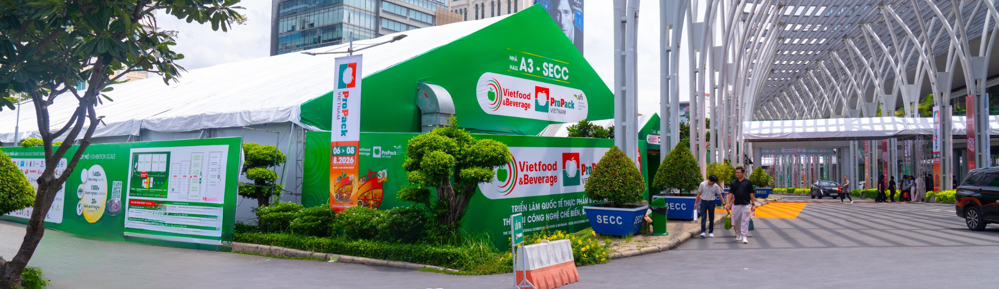
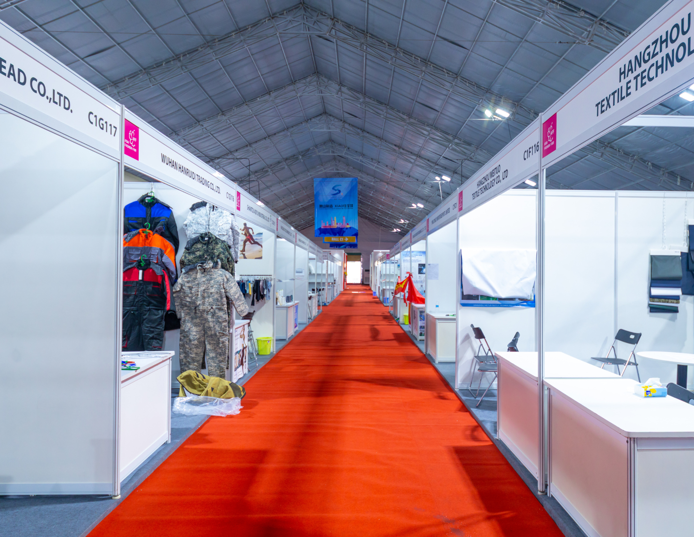
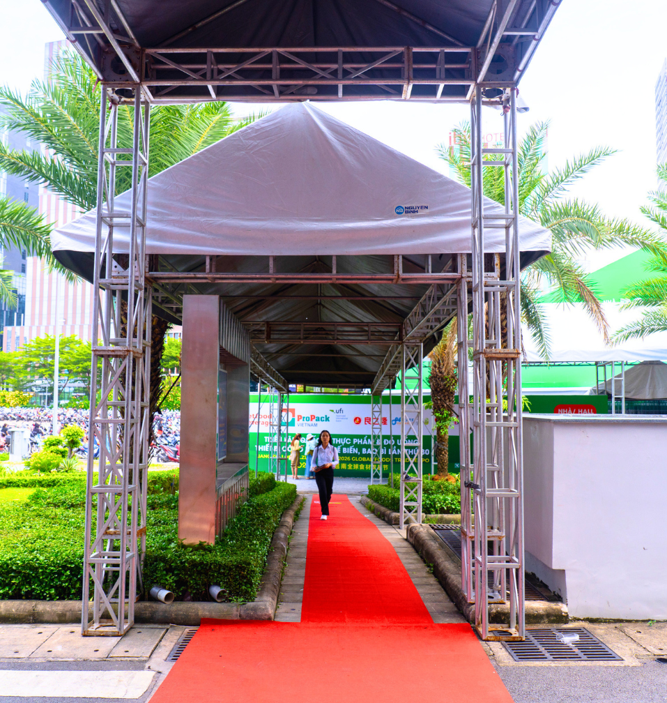
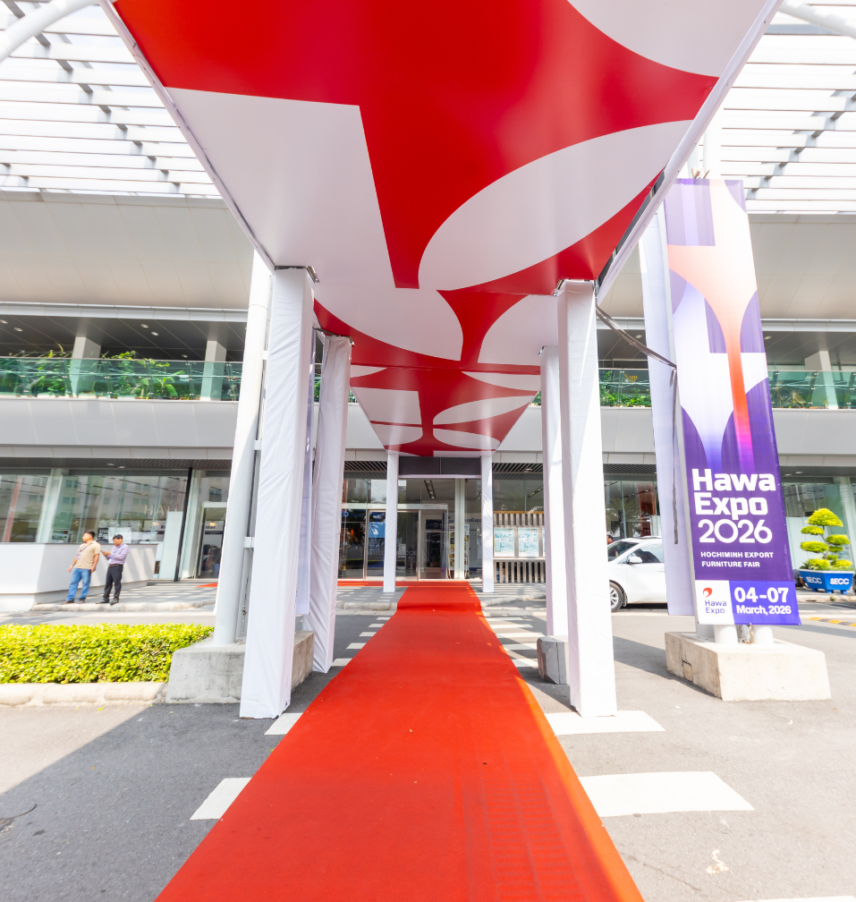

# SPEC — Thay ảnh trang `#/gioi-thieu` (v10.html)

## Goal

Khách hàng đã cung cấp 4 ảnh công trình thật trong `img/about/`. Thay 5 ảnh cũ
(đang load remote từ `nguyenbinh.com`) trên trang **Về Nguyễn Bình**
(`v10.html#/gioi-thieu`) bằng 4 ảnh này, đặt đúng slot để ảnh không bị crop và
thông điệp từng section được minh hoạ chính xác. Kết quả quan sát được: mở
`#/gioi-thieu`, hero + block **(01) Tầm nhìn** + block **(02) Sứ mệnh** dùng ảnh
local mới, không còn request nào tới `nguyenbinh.com` cho 5 ảnh đó, layout không
lệch ở cả desktop và mobile.

## Ảnh & mapping (đã chốt — không đổi thứ tự)

| File | Kích thước | Tỉ lệ | Slot | Crop |
|---|---|---|---|---|
| `img/about/hero.png` | 1911×554 | 3.45:1 | `.hero-sub .bgim img` | cover, cắt 2 bên (giữ tâm) |
| `img/about/tam_nhin_1.png` | 1436×1112 | 1.29:1 | `.stack-media .m1` (section 01) | **0%** — `aspect-ratio:4/3.1` = 1.29 |
| `img/about/tam_nhin_2.png` | 957×1008 | 0.949:1 | `.stack-media .m2` (section 01) | **0%** — `aspect-ratio:1/1.05` = 0.952 |
| `img/about/su_menh_1.png` | 957×1008 | 0.949:1 | ảnh đơn (section 02) | ~0.3% |

Lý do chọn (khớp thông điệp):

- `hero.png` — mặt ngoài SECC với branding Vietfood & Beverage / ProPack: đúng
  thông điệp "Hồ sơ năng lực" + SECC là khách hàng chủ lực.
- `tam_nhin_1.png` — nội thất nhà bạt triển lãm, lối đi dài, thấy rõ kết cấu
  khẩu độ lớn không cột giữa → minh hoạ "15+ năm dẫn đầu", quy mô, chuẩn quốc tế.
- `tam_nhin_2.png` — cổng truss lối vào, có người đi → human scale + chi tiết
  hoàn thiện, bổ trợ cho ảnh toàn cảnh ở trên.
- `su_menh_1.png` — mái bạt in thương hiệu Hawa Expo 2026 (đỏ/trắng), ảnh nổi
  bật nhất trong bộ → minh hoạ trực tiếp "Mọi không gian đều có giải pháp phù hợp"
  (bạt in riêng theo từng khách).

## Files & thay đổi

Chỉ sửa **`nguyenbinh-redesign/v10.html`** (đã chốt: sửa tại chỗ, không tạo v11).
Không thêm CSS mới — dùng inline `style` như các chỗ khác trong file.

### 1. Hero — dòng 1126

```html
<div class="bgim"></div>
```

Giữ `alt=""`: ảnh nền trang trí, nằm sau scrim tối. Không thêm `loading="lazy"`
(ảnh above-the-fold, giống pattern `img/hero-nhabat.jpg` ở trang `nha-bat`).

### 2. Section (01) Tầm nhìn — dòng 1146–1147

```html


```

Giữ nguyên `class="m1"` / `class="m2"` và `<div class="stack-media reveal d1">`.

### 3. Section (02) Sứ mệnh — dòng 1166–1169

Khách chỉ có **1 ảnh** cho section này, trong khi `.stack-media` cần 1 ảnh
landscape (`.m1`) + 1 ảnh vuông (`.m2`). Đưa `su_menh_1.png` vào `.m1` với tỉ lệ
gốc và **bỏ `.m2`** — không nhồi ảnh cũ vào để tránh trộn ảnh mới với thumbnail
WP cũ (300×200, chất lượng thấp). Đồng thời tạo nhịp thị giác khác với section 01
thay vì lặp lại y hệt bố cục xếp lớp.

Thay cả block `<div class="stack-media reveal">…</div>` (4 dòng) bằng:

```html
      <div class="stack-media reveal">
        
      </div>
```

Cũng cập nhật comment ở dòng 1163 cho khỏi lạc hậu:
`<!-- Sứ mệnh — ảnh công trình Hawa Expo 2026 do khách cung cấp -->`

### 4. Git

`img/about/` hiện **chưa được track** (`git status` → `?? img/about/`). Phải
`git add img/about/` cùng commit, nếu không GitHub Pages sẽ 404 cả 4 ảnh.

## Approach

Sửa tuần tự 4 điểm ở trên bằng `Edit`, rồi verify một lượt (thay đổi thuần
`src`/markup, không có logic — không cần TDD, không có test harness trong repo).
Không đụng `<script>`, không đụng `SHOW`/`PROJECTS`.

## Out of scope

- **Ảnh CEO** (dòng ~1153) vẫn trỏ `Logo.png` làm placeholder. Khách chưa gửi
  ảnh chân dung → giữ nguyên. *Cần yêu cầu khách cung cấp ảnh CEO Nguyễn Tích
  Bình, tỉ lệ ~1:1.05, để thay sau.*
- **3 card "Lĩnh vực hoạt động"** (dòng ~1197–1210) giữ ảnh remote `3-min.png`,
  `4-min.png`, `5-min.png`. Không tái sử dụng 4 ảnh mới ở đây (sẽ lặp ảnh 2 lần
  trên cùng một trang).
- **Tối ưu dung lượng ảnh**: đã chốt dùng nguyên file PNG gốc. Lưu ý trang
  `#/gioi-thieu` sẽ tải thêm ~7 MB (hero 1,78 MB + tam_nhin_1 2,24 MB +
  tam_nhin_2 1,74 MB + su_menh_1 1,22 MB). Nếu sau này thấy chậm, xuất JPEG
  q80 (~200–400 KB/ảnh) là bước tiếp theo.
- **Bản copy ở root** `../nguyenbinh-redesign-v10.html`: đã **drift** khỏi
  `v10.html` từ trước (1981 vs 2366 dòng) nên không phải mirror byte-identical
  như `../CLAUDE.md` mô tả. Không sync trong lần này.
- Các trang khác (`index.html`, `v2`–`v9`) không đổi.

## Verification

```bash
git -C /Users/nhatnguyen/Documents/Design/nguyenbinh-redesign status --short img/about
```

1. `preview_start {name: "static-server"}` → mở
   `http://localhost:8931/v10.html#/gioi-thieu`.
2. `read_network_requests` — **pass khi**: 4 request `img/about/*.png` đều
   `200`, và **không** còn request nào tới `nguyenbinh.com` cho 5 URL cũ
   (`nha-bat-nguyen-binh-gioi-thieu-scaled.jpg`, `about-1024x576.png`,
   `co-so-ha-tang-nha-bat-nguyen-binh-1-300x246.jpg`,
   `co-so-ha-tang-nha-bat-nguyen-binh-1-1024x838.jpg`,
   `nha-bat-nguyen-binh-4-300x200.jpg`).
3. `read_console_messages` — không có error mới.
4. Screenshot ở `desktop` (1280×800): kiểm tra (a) chữ trên hero còn đọc rõ trên
   ảnh SECC mới, (b) `.m2` của section 01 không đè mất nội dung, (c) ảnh Sứ mệnh
   đơn không kéo section cao lệch so với cột chữ (`.split` cho cột media
   `1.05fr` nên ảnh cao ~600px — chấp nhận được, nhưng phải xem thật).
5. `resize_window {preset: "mobile"}` + reload → screenshot: ở `max-width:920px`
   `.split` về 1 cột, `.m2` dịch `right:8px`; xác nhận không tràn ngang.
6. Nếu chữ hero bị chìm vào vùng sáng của ảnh, thêm
   `style="object-position:70% center"` vào `img` của `.bgim` (scrim tối nhất ở
   bên trái — dịch ảnh sang phải để phần sáng nằm ngoài vùng chữ). Chỉ làm khi
   screenshot cho thấy cần.

Definition of Done: bước 2 + 4 + 5 phải có output/screenshot thực tế, không được
suy đoán.
